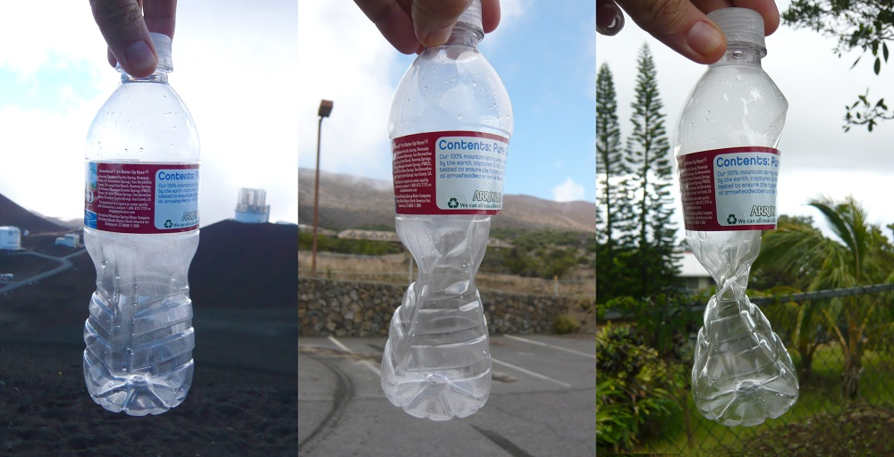

Pressure, generally speaking, is the force applied to a surface per unit of area. Imagine a brick sitting on a table. The force of the brick's weight is being applied through the surface area of the table which the brick touches. If you were to balance the brick on a needle, the force of its weight would be concentrated on the area of the needle's tip. Therefore, the pressure applied to the table is much higher.

Atmospheric pressure (also known as barometric pressure) is the pressure exerted by the weight of air in the Earth's atmosphere. Air pressure is pushing on every part of your body all the time. The pressure inside your body is the same as outside, though, so you don't feel anything. The unit of measurement for atmospheric pressure is usually bars or millibars. One bar, which is 1000 millibars, is about equal to the atmospheric pressure on Earth at sea level.

### Facts about pressure

- Atmospheric pressure increases smoothly from the edge of outer space down to the Earth's surface (sea level). The plastic bottle below demonstrates this: it was sealed at approximately 4300 metres altitude, and got crushed by the increase in atmospheric pressure at 2700 metres and then 300 metres as it was carried down towards sea level.

    

- Animals and plants need atmospheric pressure in order to survive. The low air pressure above 8000 metres altitude is dangerous to humans, which is why mountain climbers call this zone the [Death zone](http://simple.wikipedia.org/wiki/Death_zone){:target="_blank"}. The summit of Mount Everest is in this zone.
- The [Armstrong limit](http://en.wikipedia.org/wiki/Armstrong_limit){:target="_blank"} is the altitude above which humans absolutely cannot survive in an unpressurised environment. This limit is at around 19000 metres.
- The International Space Station orbits Earth at about 400 km (400000 metres) altitude, which is way past the Armstrong limit and right out in the emptiness of space. In space, where there's no atmosphere, the pressure is zero millibars. However, the air pressure inside the ISS is maintained at about 1013 millibars, which is nice and comfortable for the crew.

